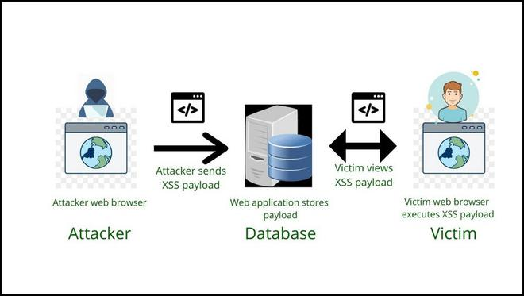
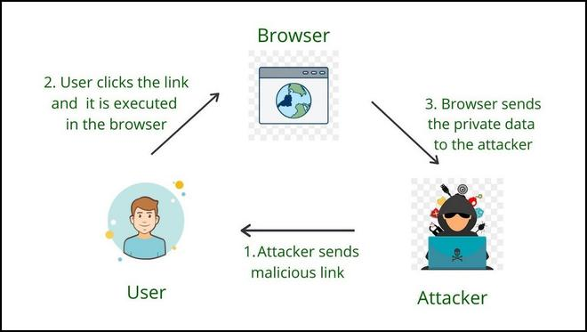
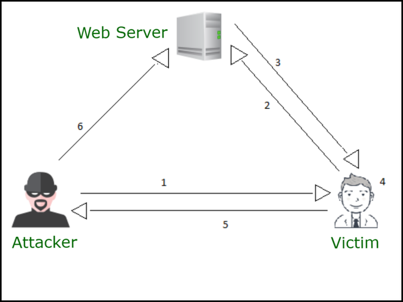
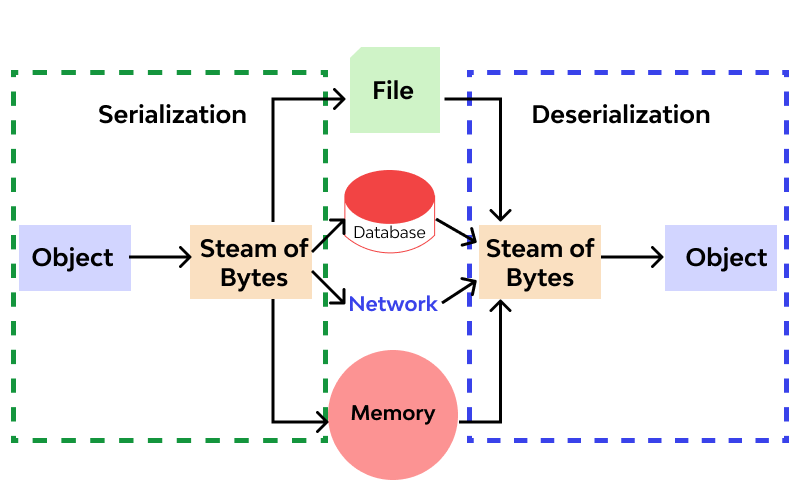

# Master OWASP Web Application Security

SKF Security Knowledge Framework - open source web project to understand security
ZAP Sed Attack Proxy - penetration testing tool
ASVS = Application security verification standard

OWASP - Top 10
- Common vulnerabilities , real consequences
- Framework for prioritization

## A1 - Injection
  
- Injection attacks occur when an attacker is able to inject malicious code into an applications data input
  - SQL injection
  - OS commands
  - LDAP queries  
- Impact of Injection
  - Steal of manipulate data
  - Gain unauthorised attack
  - Disrupt the application’s normal operation
- Prevention and Mitigation
  - Input validation
  - Prepared statements
  - Parameterized queries

## A2 : Broken Authentication

- Authentication is the process of verifying the identity of the user, ensure that they are who they claim to be
- Common Authentication Flaws
  - Weak passwords - brute force attacks 
  - Insufficient session management - hijack valid sessions
  - Issues with password recovery - weak password recovery allows hackers to 
- Impact of Broken authentication
  - Unauthorised access
  - Data exposure
  - Identity theft
- Prevention and Mitigation
  - Strong password policies
  - Secure session mangement practices
  - Robust password recovery mechanisms

## A3 : Sensitive Data Exposure

- User credentials, financial data, health care records
- Sensitive data is at the core of many web applications and its a primary target for attackers
- Common Data Exposure Scenarios
  - Inadequate data encryption
  - Insufficient access controls
  - Flawed authentication and session management
- Impact of Data Exposure
  - Financial losses
  - Reputation damage
  - Legal ramifications
  - Loss of trust
- Prevention and Mitigation
  - Robust data encryption
  - Access control mechanisms
  - Secure authentication and session management

## A4 : XML External Entities (XXE)

- XML is used for data storage and transfer, can lead to vulnerabilities
- XXE occurs when attacker influence the procession of XML documents by including external entities
- Impact of XXE
  - Access to sensitive files
  - Disrupt the applications functionality
  - Execute arbitrary code
  - Application processes user-provided XML without proper validation, it can be manipulated to execute XXE attacks
- Prevention and Mitigation
  - Disable external entity references
  - Validate input
  - Use secure XML parsers

## A5 : Broken Access Control

- Role of access control : Defines who can access what parts of an application
    - Occurs when developers do not properly enforce access restrictions
    - Impact of Broken Access Control
        - Unauthorised access
        - Manipulation of data
        - Privacy breaches
        - Common Vulnerability Scenarios
            - Lack of proper authentication checks
            - Missing authorisation. Checks
            - Predictable resource locations
    - Prevention and Mitigation
        - Strong session management
        - Access control lists
        - Enforcement of role-based access
## A6: Security misconfiguration
  - Default settings that are left unchanged
    - Overly permissive permissions
    - Unnecessary services or features
    - Impact of Security misconfiguration
        - Data exposure
        - Unauthorised access
        - Manipulate an applications settings
    - Common Misconfiguration scenarios
        - Leave default admin credentials unchanged
        - Expose sensitive information through error messages
        - Fail to restrict directory listings
    - Prevention and Mitigation
        - Thorough testing
        - Regular review and update security settings
## A7 : Cross Site Scripting - XSS
  - When an attackers can inject malicious scripts into web pages viewed by other users
    - CSS - stored, reflected and DOM based attacks
    - Stored XSS : Attacker sends payload and web application stores it and user web browser executes the code
    -  https://www.geeksforgeeks.org/understanding-stored-xss-in-depth/ 
    - 
    - Reflected XSS : Attacker tricks user into clicking malicious link or visiting wrong website
    - https://www.geeksforgeeks.org/reflected-xss-vulnerability-in-depth/
    - 
    - DOM based XSS  : Manipulating Document Object Model in user browser 
    - https://www.geeksforgeeks.org/dom-based-cross-site-scripting-attack-in-depth/
    - 
    - Impact of XSS
        - Data theft
        - Session hijacking
        - Defacement of a web application
    - Prevention and Mitigation
        - Input validation
        - Output encoding
        - Content Security Policy - CSP
- A8 : Insecure Deserialisation 
    -  
    - Insecure deserialisation lead to attacks that exploit the deserialisation process to execute malicious code
    - Deserialisation : Process of converting data from a serialised format (often used for data storage or transmission) back into its original state
    - Insecure deserialization occurs when untrusted data is deserialized without proper validation
    - Impact of Insecure Deserialization
      - Execute arbitrary code
      - Take control of application
      - breach security
    - CVS
      - Use of untrusted data from unauthenticated sources
      - Outdated or vulnerable deserializaton libraries
      - Insecure configurations
    - Prevention and Mitigation
      - Validate and sanitize incoming data
      - Use safe deserialization libraries
      - Limit the use of deserialization
- A9 : Using Components with Known Vulnerabilities
  - Components
    - Frameworks
    - Libraries
    - Plugins 
  - Impact of Using Components with Known Vulnerabilities
    - Data breaches
    - Unauthorized access
    - Compromised application functinality
  - Common Vulnerability Scenarios
    - Failing to update or patch components
    - Rely on unsupported or deprecated libraries
    - Not monitoring for new vulnerabilities
  - Prevention and Mitigation
    - Regular vulnerability assessments
    - Updated with security advisors
    - Strict version control
- A10 : Insufficient Logging and Monitoring
  - Importance of Logging and Monitoring
    - Identify security incidents
    - Troubleshoot issues
    - Trail of evidence
  - It occurs when an application fails to generate adequate log records and these records are not properly monitored 
  - Impact of Insufficient Logging and Monitoring
    - Delay incident response
    - Hinder threat detection
    - Unnoticed security breaches
  - Common Vulnerability Scenarios
    - Not implementing comprehensive logging
    - Failing to monitor logs
    - Not having an indicident response
  - Prevention and Mitigation
    - Logging strategy
    - Regulary log review
    - Automated monitoring systems

# Principles of Secure Coding

- Principle 1 - Input Validation
  - SQL injection
  - Cross Site Scripting - XSS
- Principle 2 - Least Privilege
- Principle 3 - Defense in Depth
- Principle 4 - Secure by Design
- Principle 5 - Error Handling and Logging
- Principle 6 - Encryption
- Principle 7 - Patch Management
- Principle 8 - Security Testing

### OWASP Secure Coding Guidelines

- Secure coding is essential in preventing vulnerabilities and protect web applications from threats
- OWASP Cheat Sheet Series
- OWASP Development Guide
- OWASP Secure Coding Practices Quick Reference Guide
- OWASP Web SEcurity Testing Guide
- OWASP Application Security Verification Standard (ASVS)

## Input Validation and Output Encoding

- Importance of Input Validation : Ensures that the data your application receives is safe and within expected parameters
- Key Input Validation Techniques:
  -  Data type checking
  -  Input length limits
  -  Filter and sanitize user inputs
- Output Encoding for XSS Prevention
- Importance of Contextual Output Encoding : Tailors the encoding to the specific context where data is displayed
- Common Ouput Encoding Techniques
  - HTML encoding
  - URL encoding
  - JavaScript encoding
  - CSS encoding

## Authentication and Session Management

- Importance of Authentication
  - Process of verifying the identity of users before granting them access to your application 
- Key Authentication Techniques
  - Username and password
  - Multi-factor authenticaton (MFA)
  - Token-based
- Session Management and Security
  - Create, track, ad destroy sessions securely to prevent unauthorized access and session fixation attacks 
- Common Session Management Techniques
  - Secure session tokens
  - Session timeouts
  - Encrypting session data
- Implement Authentication and Session Management
  - Right authentication methods
  - Secure session handling
  - Proper session termination 
